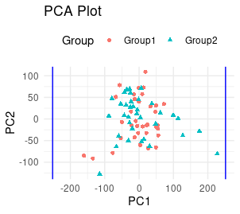

# Comparative Analysis of High Versus No Mutations in the TP53 Gene in Prostate Cancer (PRAD) Using the TCGA Pipeline

**Author:** Raj Habib

## Thesis Statement
The primary objective of this project is to compare the **high versus no mutations** in the TP53 gene in prostate cancer (PRAD) using the TCGA pipeline for data isolation and filtering.

## Materials and Methods

### Data Source
This project utilized the **Genomic Data Commons (GDC)** portal to isolate the TCGA, PRAD, and TP53 datasets. Specifically, two groups were analyzed: 
- **High mutations** in TP53
- **No mutations** in TP53

### Key Steps
1. **Selection of the gene of interest** (TP53).
2. **Application of filters** on the GDC portal to isolate the relevant datasets:
   - TCGA
   - TCGA-PRAD
   - TP53 (Gene)
     - High Mutation
     - No Mutation
3. **Data processing**:
   - Followed the TCGA pipeline to combine and filter the datasets, creating the `samDF2` dataframe.
   - Grouped data based on **high mutations** versus **no mutations** in TP53.
4. Random sampling was applied to reduce group sizes for analysis, selecting **50 random samples** from Group 2 (high mutation).

### Software and Packages Used
- **RStudio** for analysis
- **R Packages**: 
   - `ggplot2`
   - `ggrepel`
   - `tidyselect`
   - `TCGAbiolinks`
   - `DESeq2`
   - `readr`

## Filters Applied
- **TCGA** 
- **TCGA-PRAD**
- **TP53 (Gene)**:
  - High Mutation
  - No Mutation

## Results

- **Samples per grouping**: 70 (No mutation), 156 (High mutation)
- **Number of genes analyzed**: 29,036
- **Number of significantly differentially expressed genes**: 10,818
- **Most significantly differentially expressed gene**: ENSG00000123407.4

### Visualizations

- **PCA Plot**: Demonstrates that data points are correlated and suitable for further analysis.

- **Volcano Plot**: A comprehensive overview of gene expression data. Key observations:
  - **X-axis**: Represents log2(Fold Change) ranging from -2.5 to 2.5, indicating the extent of upregulation or downregulation of genes.
  - **Y-axis**: Represents -log10(adjusted p-value) scaling from 0 to 6, highlighting statistical significance.
  - **Color coding**: Corresponds to log10(Mean) expression levels, showing a gradient of gene expression intensity.
  - Critical insights are drawn from genes with significant fold changes and low p-values, which may play crucial roles in biological processes under study.

## Supplementary Files

The following supplementary files are attached to this project:
1. `highmutationsgdc.tsv`: Contains all high mutations in TP53 in PRAD.
2. `nomutationsgdc.tsv`: Contains no mutations in TP53 in PRAD.
3. `Project1.csv (samDF2)`: A combined and filtered dataset of the high and no mutation files.
4. `Table_GeneData.csv`: Includes all the genes used in the analysis with extra information.

---
